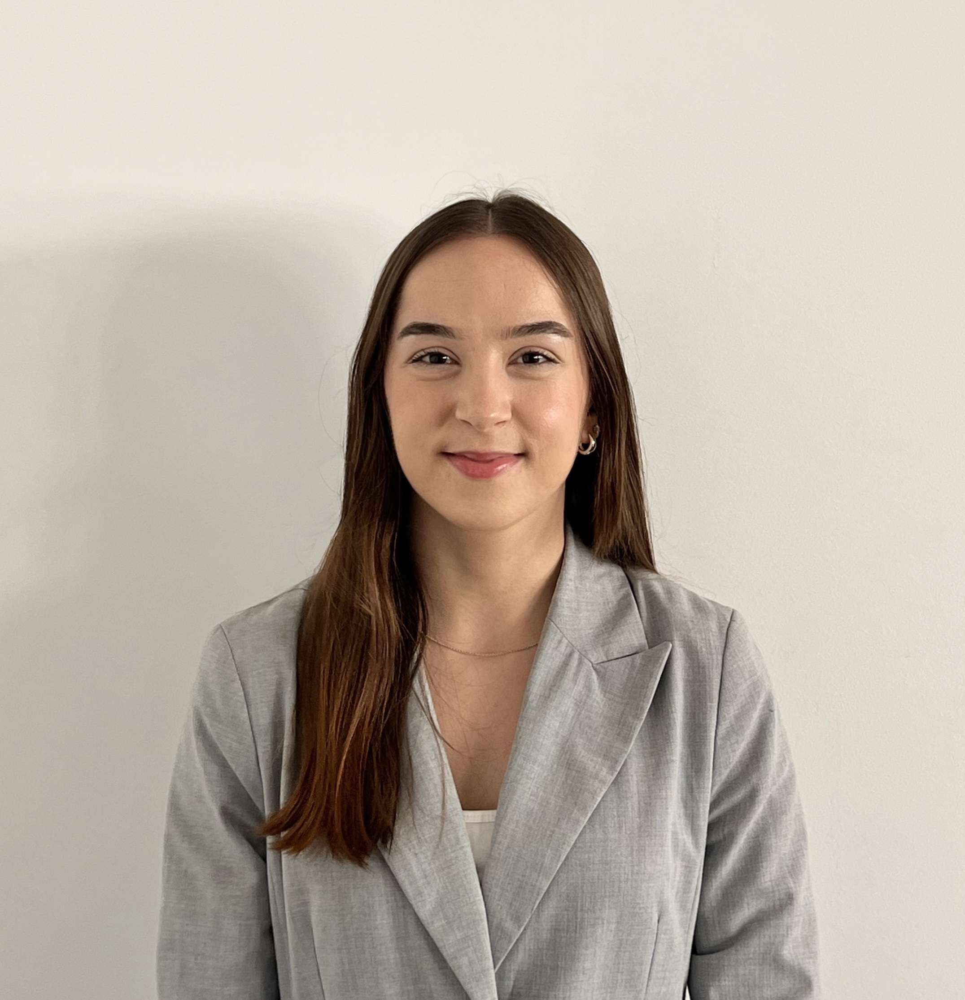
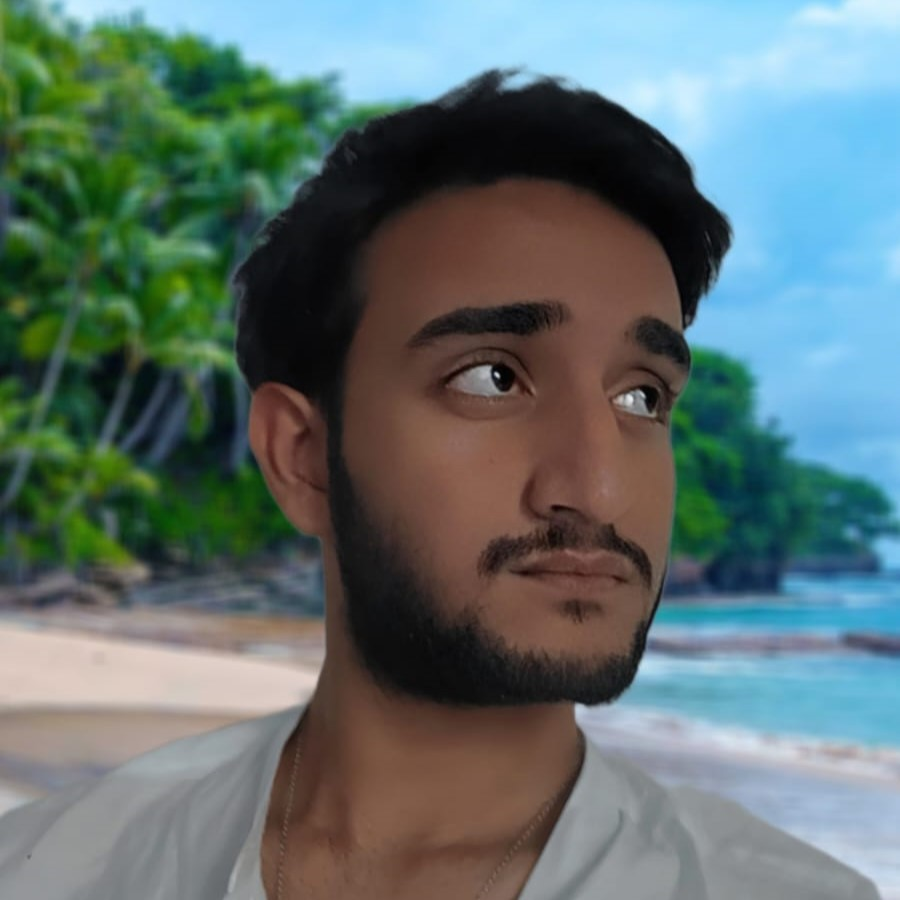
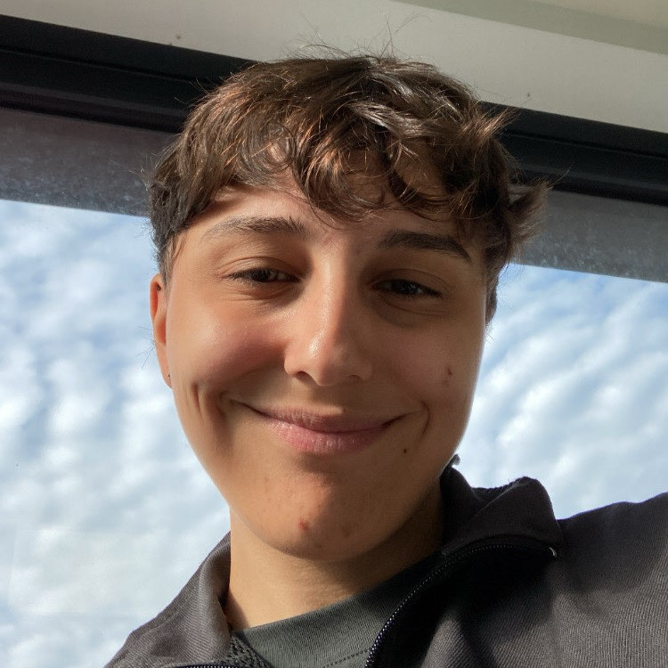

# Matière Cœur

---

## Site d'Accessibilité & Émotions

- #### **Description du Projet :**
    - Le site "Matière Cœur" présente des informations détaillées sur divers troubles neurodéveloppementaux (autisme, troubles visuels, TDAH, etc.) et propose des solutions digitales pour améliorer la communication et l'accessibilité. Il ***fournit des conseils sur la communication efficace*** et des ***outils technologiques adaptés pour chaque type*** de trouble.
    
- #### **Objectif du Projet :**
    - Le projet "Matière Cœur" vise à sensibiliser à la diversité neurodéveloppementale et à l'accessibilité numérique en explorant les différents raisonnements et ressentis des personnes neurodiverses. Il s'agit de rendre les idées possibles en intégrant des solutions digitales adaptées aux besoins de chacun.

- #### **Technologies et Outils Utilisés :**
    - **HTML, CSS, JavaScript :** Développement du site web.
    - **Applications de soutien :** Utilisation d'outils comme *Proloquo2Go, NVDA, JAWS* pour améliorer l'accessibilité.

- #### **Lien vers le site :**  
    - [Visitez *'matière cœur'*](https://cosmo-vibe.github.io/matiere-coeur/)  

---

### L'équipe

|  |  |  |  |
|---|---|---|---|
| **Matthias DA COSTA :** Motion designer. | **Océane DOS SANTOS :** Cheffe de projet. | **Dramsy Shahm N. :** Développeur web. | **Shelley FENOUILLET :** Graphiste. |

---
